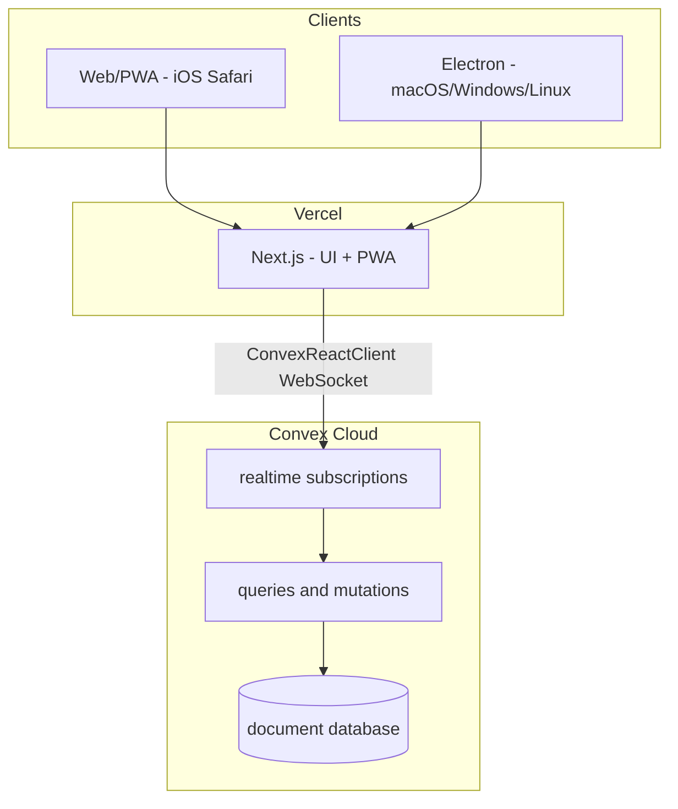
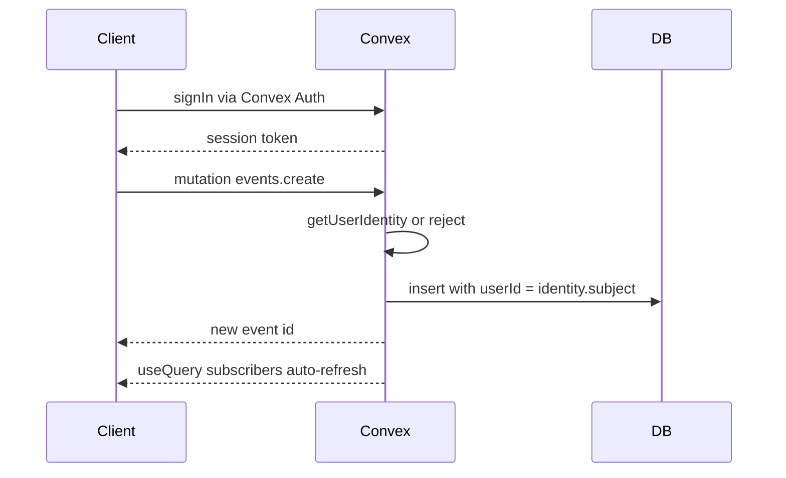
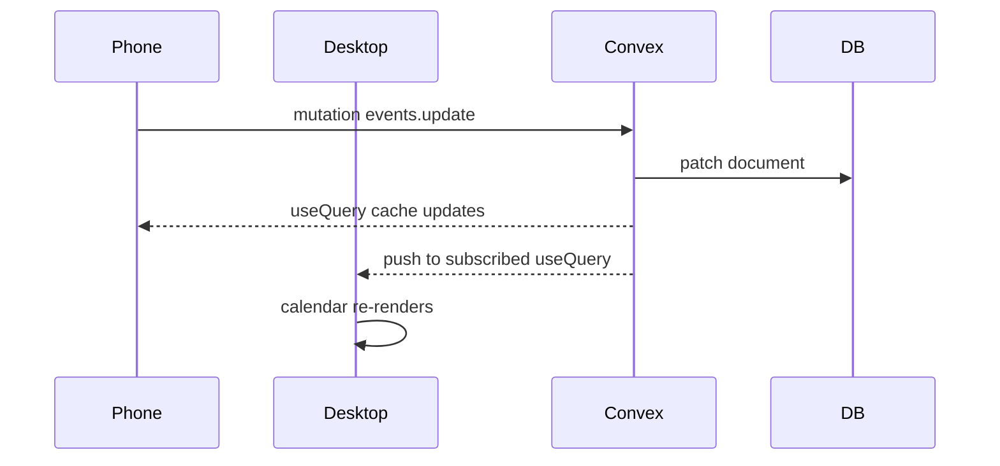

# Scheduler App — Architecture Plan

> Personal calendar app: Next.js on Vercel + Convex for live sync, Electron desktop, PWA on iOS.

## Goals

- Apple Calendar–style experience: month/week/day views, create/edit/delete events, drag to reschedule (later).
- **Desktop**: Electron (your preference).
- **Mobile (iOS)**: responsive website + PWA (“Add to Home Screen”) — no App Store.
- **Sync**: same account, same events on all devices in **real time**.
- **Privacy**: single account; no sharing, no multi-tenant complexity.
- **Personal / learning**: just you as the user; stay on free tiers; use this project to learn Convex.

---

## Tech stack (locked in)

| Layer | Choice |
|-------|--------|
| Language | **TypeScript** (strict) everywhere |
| UI | **React 19** |
| Styling | **Tailwind CSS v4** + **shadcn/ui** |
| Web framework | **Next.js App Router** (hosted on **Vercel**) |
| Backend + DB + sync | **Convex** (hosted on Convex cloud) |
| Client data | **`useQuery` / `useMutation`** from `convex/react` (reactive, live-updating) |
| Calendar widget | FullCalendar or `@schedule-x/calendar` |
| Auth | **Convex Auth** (email/password or OAuth — start simple) |
| Desktop shell | Electron via `electron-vite` → loads Vercel URL |
| Mobile | Responsive PWA (`@serwist/next`) — no App Store |
| Offline | Online-first for v1; Convex auto-reconnects; Dexie queue optional v2 |
| Monorepo | pnpm workspaces; optional Turborepo |
| Cost | **$0** — Vercel Hobby + Convex free tier (more than enough for one user) |

**Dropped from earlier plan:** Vercel Postgres, Drizzle, Route Handlers, TanStack Query polling.

---

## Recommended shape: one app, three shells



**Why Convex for this project:**
- **Live sync for free** — edit on phone, desktop updates instantly via reactive `useQuery`.
- **Less backend code** — no Route Handlers, migrations, or polling loop to build/maintain.
- **TypeScript end-to-end** — schema + API in `convex/`; generated types flow to the client.
- **Good learning project** — small enough to grasp, real enough to be useful daily.
- **Vercel still hosts the UI** — `npx convex deploy --cmd 'npm run build'` deploys both on push.

**Alternative shells (not MVP):** Tauri instead of Electron — same web UI inside.

---

## What Convex gives you (learning map)

| Concept | In your scheduler |
|---------|-------------------|
| **Schema** (`convex/schema.ts`) | `events` table with indexes |
| **Query** (read, reactive) | `events.list` — calendar subscribes; auto-updates |
| **Mutation** (write) | `events.create`, `events.update`, `events.remove` |
| **Auth** | `ctx.auth.getUserIdentity()` in every function |
| **Client hooks** | `useQuery(api.events.list)`, `useMutation(api.events.create)` |
| **Deploy** | `convex dev` locally; `convex deploy` to production via Vercel build |

Convex handles WebSockets, cache invalidation, and cross-device push — the hardest parts of the original plan.

---

## Convex backend

```text
convex/
  schema.ts          # events table definition
  events.ts          # list, create, update, remove
  auth.ts            # Convex Auth config (if using auth setup file)
  http.ts            # optional — webhooks later
```

### Schema (MVP)

```ts
// convex/schema.ts
events: defineTable({
  title: v.string(),
  description: v.optional(v.string()),
  location: v.optional(v.string()),
  startAt: v.number(),       // Unix ms
  endAt: v.number(),
  allDay: v.boolean(),
  timezone: v.string(),
  color: v.optional(v.string()),
  userId: v.string(),        // from auth identity
}).index("by_user", ["userId"])
```

No separate `users` table required for MVP if Convex Auth manages identity. Events are scoped by `userId` from `ctx.auth.getUserIdentity()`.

### Example functions

```ts
// convex/events.ts
export const list = query({
  handler: async (ctx) => {
    const identity = await ctx.auth.getUserIdentity();
    if (!identity) return [];
    return ctx.db
      .query("events")
      .withIndex("by_user", (q) => q.eq("userId", identity.subject))
      .collect();
  },
});

export const create = mutation({
  args: { title: v.string(), startAt: v.number(), endAt: v.number(), allDay: v.boolean() },
  handler: async (ctx, args) => {
    const identity = await ctx.auth.getUserIdentity();
    if (!identity) throw new Error("Unauthenticated");
    return ctx.db.insert("events", { ...args, userId: identity.subject, timezone: "America/..." });
  },
});
```

---

## Security model (single account)



**Rules (same spirit as Route Handlers, different syntax):**
- Every `query` and `mutation` calls `ctx.auth.getUserIdentity()` — return empty or throw if missing.
- All reads/writes filter by `userId` — no cross-user access.
- No admin keys in the client; only `NEXT_PUBLIC_CONVEX_URL` is public (expected).
- Convex Auth handles password hashing; never store credentials in your schema.

**vs Supabase/Firebase horror stories:** Convex has no separate RLS rules file. Security is imperative TypeScript in each function — if you forget the auth check, that function is exposed. Keep a checklist: auth check first line of every exported function.

---

## Sync flow (reactive — no polling)



- Both devices hold a live `useQuery(api.events.list)` subscription.
- Mutations on one device push updates to all subscribers automatically.
- On reconnect after offline: Convex client resyncs; no manual `since` endpoint needed for v1.
- Conflict: last write wins (Convex mutation order); rare for solo use.

---

## Client architecture (`apps/web` — Next.js)

| Layer | Choice | Notes |
|-------|--------|-------|
| Framework | **Next.js App Router** | Vercel deploy root |
| Provider | **`ConvexClientProvider`** | Wraps app in `layout.tsx` |
| Server state / sync | **`convex/react` hooks** | Replaces TanStack Query for events |
| UI | **React client components** | Calendar page is `'use client'` |
| Components | **shadcn/ui** | Sheet for mobile event editor, Dialog on desktop |
| Styling | **Tailwind CSS** | Mobile-first |
| Calendar views | FullCalendar or `@schedule-x/calendar` | Map Convex events → calendar props |
| PWA | `@serwist/next` | Install on iOS via Add to Home Screen |
| Electron | `apps/electron` | Loads Vercel production URL |

**Client pattern:**
```tsx
const events = useQuery(api.events.list);
const createEvent = useMutation(api.events.create);

// events is undefined while loading, [] when empty, then live-updates
```

**shadcn on mobile:** `Sheet` for create/edit (bottom slide), touch-friendly Tailwind spacing (`min-h-11`).

**Electron:** load `https://scheduler.vercel.app` — same Convex-backed app as mobile/web.

**iOS PWA caveats:** background WebSocket may pause; Convex reconnects on reopen. Push notifications skip v1.

---

## Monorepo layout

```text
scheduler/
  apps/
    web/                    # Next.js + ConvexProvider + PWA (Vercel root)
    electron/               # electron-vite → Vercel URL
  convex/                   # schema, events.ts, auth — deployed to Convex cloud
  packages/
    shared/                 # optional — date helpers; types come from convex/_generated
```

Tools: **pnpm workspaces**. Vercel build command: `npx convex deploy --cmd 'npm run build'`.

---

## MVP scope

**V1 — ship this:**
- Sign up / log in (Convex Auth)
- Month + week + day views
- Create, edit, delete events (title, start, end, all-day)
- **Live sync** across desktop + mobile + PWA

**V2 — after it feels good:**
- Recurring events
- Drag-and-drop reschedule
- Multiple calendars / colors
- `.ics` import/export (Convex action or client-side)
- Offline queue (Dexie)
- Electron menu bar / tray quick-add

**Explicitly out of scope for v1:**
- Sharing calendars
- Native iOS App Store app
- Google/Apple Calendar sync

---

## Deployment (Vercel + Convex)

| Piece | Where |
|-------|--------|
| Next.js UI + PWA | **Vercel** (`apps/web`) |
| Backend + DB + realtime | **Convex cloud** (`convex/` folder) |
| Local dev | `npx convex dev` + `npm run dev` in parallel |
| Production deploy | Vercel build: `npx convex deploy --cmd 'npm run build'` |
| Env vars (Vercel) | `CONVEX_DEPLOY_KEY` (prod + preview keys separately) |
| Env vars (auto) | `NEXT_PUBLIC_CONVEX_URL` set by deploy command |
| Electron | GitHub Releases → points at Vercel URL |
| Custom domain | Vercel DNS for frontend; Convex URL stays on Convex |

**Preview deployments:** Convex can provision isolated preview backends per branch (use preview deploy key in Vercel Preview env).

**Cost:** Vercel Hobby ($0) + Convex free tier ($0). One user with a calendar will use a tiny fraction of Convex's 1M function calls/month and 0.5 GB storage.

---

## Decision summary

| Decision | Choice |
|----------|--------|
| Frontend hosting | **Vercel** (Next.js) |
| Backend + DB + sync | **Convex** |
| Language | TypeScript everywhere |
| UI | React + Tailwind + shadcn/ui |
| Client data | `convex/react` (`useQuery`, `useMutation`) |
| Desktop | Electron → Vercel URL |
| iOS | PWA (no App Store) |
| Users | Single account, private data |
| Auth | Convex Auth |
| Sync | **Reactive live queries** (instant cross-device) |
| Cost | Free tiers — personal use |

---

## Implementation checklist

- [x] Scaffold pnpm monorepo: `apps/web` (Next.js + Convex), `apps/electron`, `convex/`
- [x] Convex schema (events table) + Convex Auth (Password provider); auth check in every query/mutation
- [x] `convex/events.ts` — list, create, update, remove scoped to authenticated user
- [ ] Calendar UI: shadcn/ui, FullCalendar, `useQuery`/`useMutation` from `convex/react`
- [ ] Serwist/next PWA + shadcn mobile layouts; electron-vite shell loads Vercel URL
- [ ] Deploy to Vercel with `npx convex deploy --cmd build`; `CONVEX_DEPLOY_KEY`, custom domain
